# 🔐 Infraestructura 3 — VPN de Acceso Remoto (Remote-Site) con FortiGate

**Matrícula 20252241**


> Un firewall FortiGate (configurado por GUI) publica una VPN IPsec de acceso remoto. Los usuarios de la red interna pueden consultar el servidor web por HTTPS sin VPN, mientras que el acceso por SSH al servidor solo está permitido a los clientes conectados a la VPN.

---

## 📺 Video de Demostración

> **[Ver demostración en YouTube →](https://youtu.be/laqwYhb9In4)**

---

## 📑 Tabla de Contenido

1. [Objetivo de la Red](#-objetivo-de-la-red)
2. [Cumplimiento de Requisitos](#-cumplimiento-de-requisitos)
3. [Direccionamiento IP basado en la matrícula (VLSM)](#-direccionamiento-ip-basado-en-la-matrícula-vlsm)
4. [Parámetros Usados](#-parámetros-usados)
5. [Documentación de la Red](#️-documentación-de-la-red)
6. [Funcionamiento de la Configuración](#-funcionamiento-de-la-configuración)
7. [Configuración de la VPN](#-configuración-de-la-vpn)
8. [Validación de la Implementación](#-validación-de-la-implementación)
9. [Estructura del Repositorio](#-estructura-del-repositorio)

---

## 🎯 Objetivo de la Red

Demostrar una política de acceso diferenciado al servidor:

- **Servidor web (HTTPS):** accesible para el usuario de la red interna **sin necesidad de VPN**.
- **Servidor (SSH):** accesible **únicamente a través de la VPN** de acceso remoto.

Para lograrlo, el FortiGate bloquea el SSH proveniente de la red de usuarios hacia el servidor, permite el resto del tráfico de esa red, y acepta el SSH solo desde el rango de direcciones asignado a los clientes de la VPN.

---

## ✅ Cumplimiento de Requisitos

| Requisito | Implementado con |
| --- | --- |
| FortiGate configurado por GUI | Interfaces, DHCP, rutas, políticas, usuarios y VPN configurados desde la interfaz web de FortiOS |
| Configuraciones de red (FortiGate) | Interfaz WAN, subinterfaz VLAN 10, interfaz de acceso remoto y rutas estáticas |
| VPN Remote-Site entre Cliente y Servidor | VPN IPsec de acceso remoto `vpn-remote-2241` (plantilla *Dialup - FortiClient*), con un cliente Linux (strongSwan) |
| Equipo de red (Cisco) | Router `router-cisco` con configuración de red hacia el ISP y el servidor |
| ISP con IPs públicas | Router `isp` con enlaces públicos hacia el FortiGate y el router Cisco |
| Servidor Web (/28) con HTTPS y SSH | Servidor Ubuntu en `10.22.41.128/28` con Apache (HTTPS) y OpenSSH |
| Usuarios (/25) en VLAN 10 con DHCP | Subinterfaz VLAN 10 (`10.22.41.1/25`) con servidor DHCP |
| Traceroute hacia el servidor | Captura del traceroute desde el usuario |
| Acceso web sin VPN | Prueba de HTTPS desde el usuario con la VPN inactiva |
| Acceso SSH solo vía VPN | Política de bloqueo para la red de usuarios y política de permiso para el rango de la VPN |
| Direccionamiento basado en la matrícula | Redes derivadas de los dígitos `22` y `41` de la matrícula y subdivididas con VLSM |

---

## 🧮 Direccionamiento IP basado en la matrícula (VLSM)

### 1. Origen de las direcciones

Mi matrícula es **2025-2241** (`20252241`). Tomé sus **últimos cuatro dígitos, `2241`**, y los separé en dos pares, **`22`** y **`41`**, que son los que aparecen en las redes del laboratorio:

| Dígitos de la matrícula | Dónde se usan | Ejemplo |
| --- | --- | --- |
| `22` → segundo octeto | Redes LAN privadas (Usuarios y Servidor) | 10.**22**.41.0 |
| `41` → tercer octeto | Redes LAN privadas (Usuarios y Servidor) | 10.22.**41**.0 |
| `22.41` → dos primeros octetos | Enlaces "públicos" entre el ISP y los equipos | **22.41**.3.0/30 |

### 2. Bloque base y requisitos

El bloque base de las redes internas es **`10.22.41.0/24`** (254 hosts). La tarea exige:

- Una red de **Usuarios de tipo /25**.
- Una red de **Servidor de tipo /28**.
- Enlaces con IPs públicas entre el ISP y los equipos (punto a punto).

### 3. Subdivisión con VLSM

Se aplicó **VLSM (Variable Length Subnet Mask)**: se asigna primero la subred más grande y después las más pequeñas, usando un prefijo distinto para cada segmento según los hosts que necesita. Así no se desperdician direcciones y las subredes no se solapan.

| # | Segmento | Prefijo | Máscara | Hosts útiles | Red | Rango utilizable | Broadcast |
| --- | --- | --- | --- | --- | --- | --- | --- |
| 1 | Usuarios (VLAN 10) | /25 | 255.255.255.128 | 126 | 10.22.41.0 | 10.22.41.1 – 10.22.41.126 | 10.22.41.127 |
| 2 | Servidor Web | /28 | 255.255.255.240 | 14 | 10.22.41.128 | 10.22.41.129 – 10.22.41.142 | 10.22.41.143 |
| 3 | Enlace ISP ↔ FortiGate | /30 | 255.255.255.252 | 2 | 22.41.3.0 | 22.41.3.1 – 22.41.3.2 | 22.41.3.3 |
| 4 | Enlace ISP ↔ Router Cisco | /30 | 255.255.255.252 | 2 | `<COMPLETAR: red>` | `<COMPLETAR>` | `<COMPLETAR>` |

**Cálculo de cada prefijo:**

- **/25:** 32 − 25 = 7 bits de host → 2⁷ = 128 direcciones → 126 hosts útiles. Bloque `10.22.41.0 – 10.22.41.127`.
- **/28:** 32 − 28 = 4 bits de host → 2⁴ = 16 direcciones → 14 hosts útiles. Empieza justo donde termina la red de Usuarios: `10.22.41.128 – 10.22.41.143`.
- **/30:** 32 − 30 = 2 bits de host → 2² = 4 direcciones → 2 hosts útiles, los justos para un enlace punto a punto.

El resto del bloque `10.22.41.0/24` (`10.22.41.144 – 10.22.41.255`) queda libre para crecimiento futuro.

### 4. Redes de la VPN de acceso remoto

Además de las redes anteriores, la VPN usa:

| Red | Uso |
| --- | --- |
| Rango de direcciones de los clientes VPN (por ejemplo `10.212.135.10`) | Dirección virtual que el FortiGate asigna al cliente cuando se conecta |
| `192.168.237.0/24` | Red de acceso remoto del laboratorio: el cliente VPN (`192.168.237.3`) alcanza al FortiGate en `192.168.237.2` (port3) |

### 5. Asignación de direcciones

| Dispositivo | Interfaz | IP | Subred |
| --- | --- | --- | --- |
| FortiGate | `user-valn10` (VLAN 10, sobre port2) | 10.22.41.1 | 10.22.41.0/25 |
| Usuario | ens3 (DHCP, rango .10 – .100) | 10.22.41.x | 10.22.41.0/25 |
| Servidor Web | ens3 | 10.22.41.130 | 10.22.41.128/28 |
| FortiGate | `WAN-ISP` (port1) | 22.41.3.2 | 22.41.3.0/30 |
| FortiGate | port3 (acceso remoto) | 192.168.237.2 | 192.168.237.0/24 |
| Cliente VPN | ens3 | 192.168.237.3 | 192.168.237.0/24 |

**Evidencia en los equipos:**

Interfaces del router ISP:

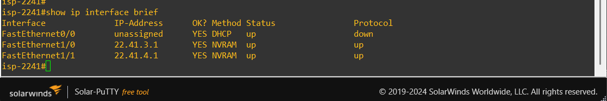

Subinterfaz VLAN 10 del FortiGate y su servidor DHCP (`10.22.41.10 – 10.22.41.100`):

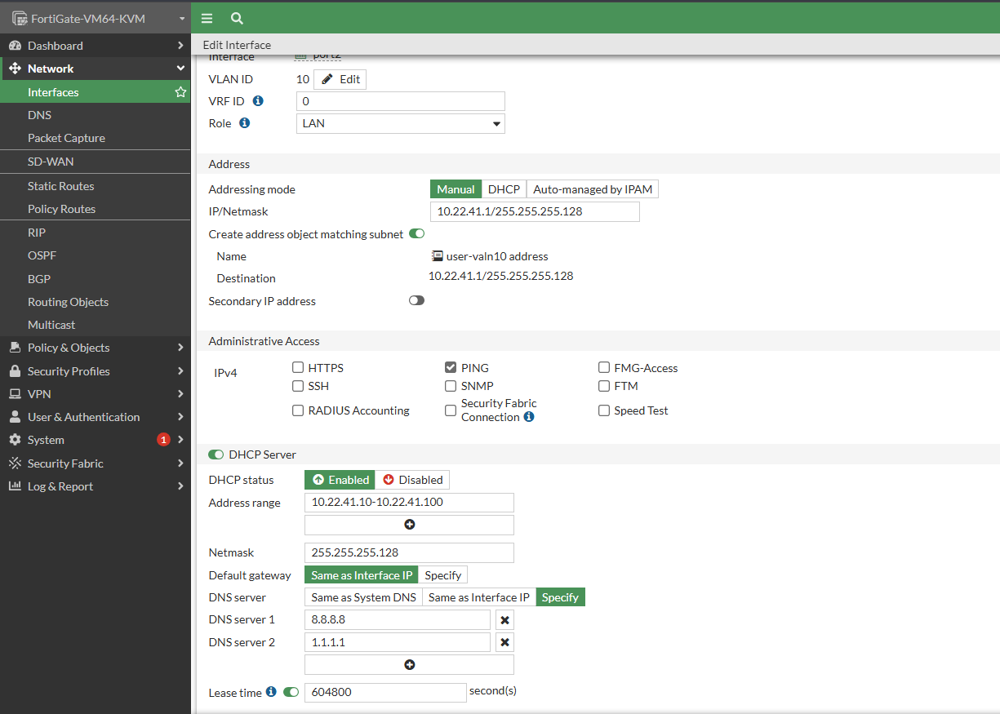

---

## 🧩 Parámetros Usados

| Parámetro | Valor |
| --- | --- |
| Plataforma FortiGate | FortiGate-VM64-KVM, FortiOS 7.0.9 |
| Equipo de red | Router Cisco (`router-cisco`) |
| ISP | Router Cisco (`isp`) |
| Switches | Cisco IOSvL2: `switch-2241-1` (usuario) y `switch-2241-2` (usuario VPN) |
| Emulador | GNS3 |
| Red de Usuarios (VLAN 10) | `10.22.41.0/25` — gateway `10.22.41.1`, DHCP `10.22.41.10 – 10.22.41.100` |
| Red del Servidor | `10.22.41.128/28` — servidor `10.22.41.130` |
| Enlace ISP ↔ FortiGate | `22.41.3.0/30` |
| Túnel VPN | `vpn-remote-2241` (plantilla *Dialup - FortiClient*, enlazado a port3) |
| Cliente VPN | Ubuntu con strongSwan, conexión `VPN-REMOTE-2241` |
| Usuario VPN | `vpn2241` (autenticación XAuth) |

---

## 🗺️ Documentación de la Red

### Topología

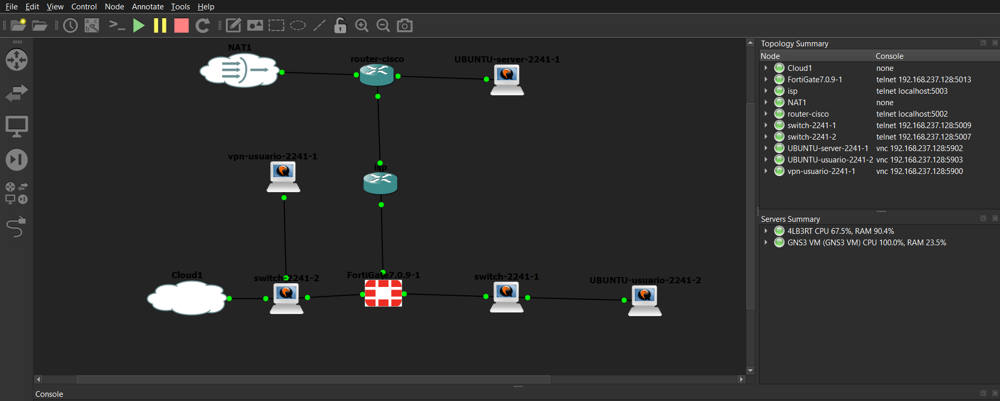

### Diagrama de acceso

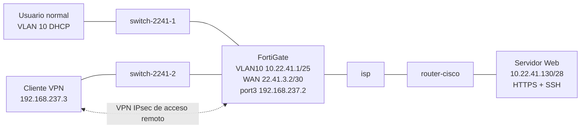

### Switches y VLAN 10

VLAN 10 creada en el switch del usuario:

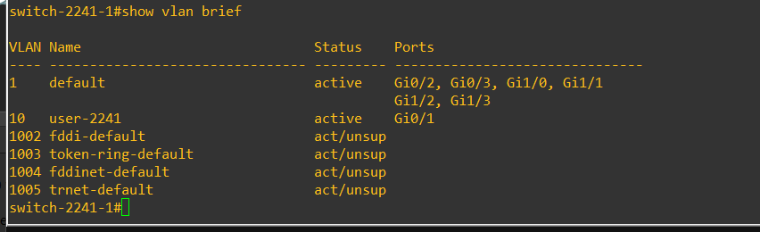

Enlace trunk del usuario hacia el FortiGate:

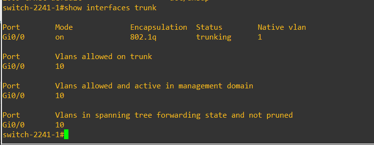

Switch del usuario VPN:

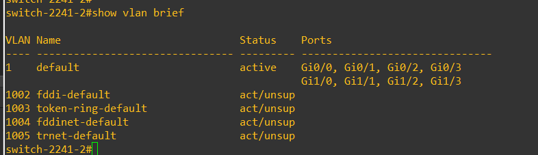

### Usuario (VLAN 10, DHCP y traceroute)

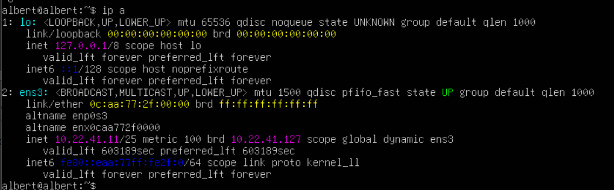

### FortiGate

Interfaces: `WAN-ISP` (port1) hacia el ISP, la subinterfaz VLAN 10 sobre port2 con su DHCP, y port3 con la interfaz de túnel `vpn-remote-2241`:

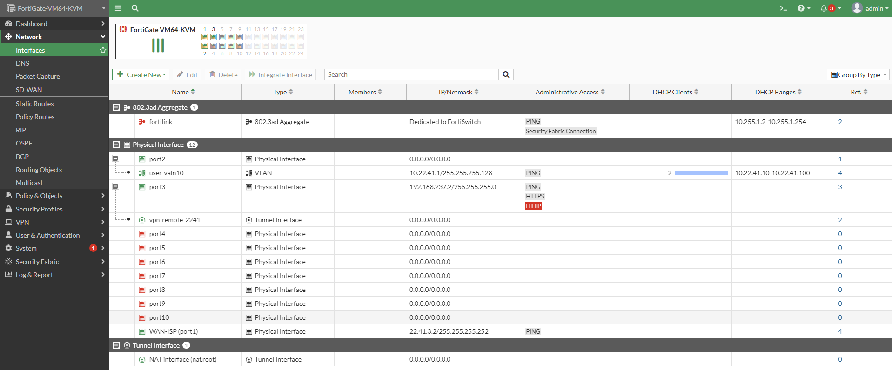

Rutas estáticas:

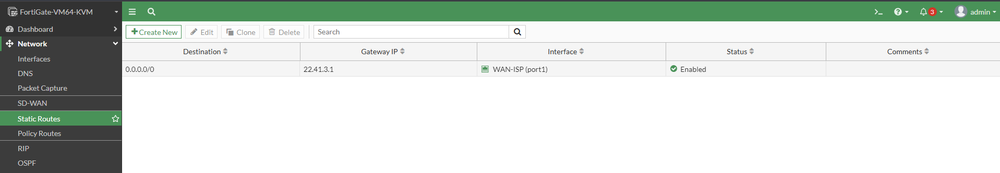

Políticas de firewall:

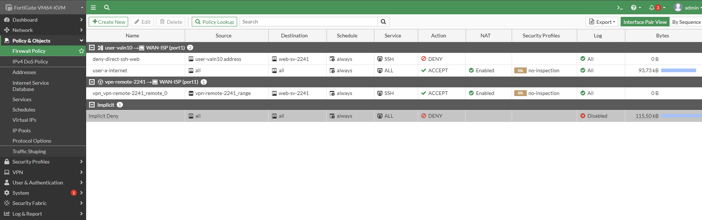

### Router Cisco y servidor

Interfaces del router Cisco:

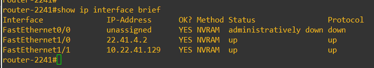

Restricciones aplicadas al servidor:

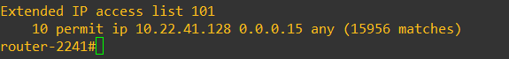

Servicios activos del servidor (HTTPS y SSH):

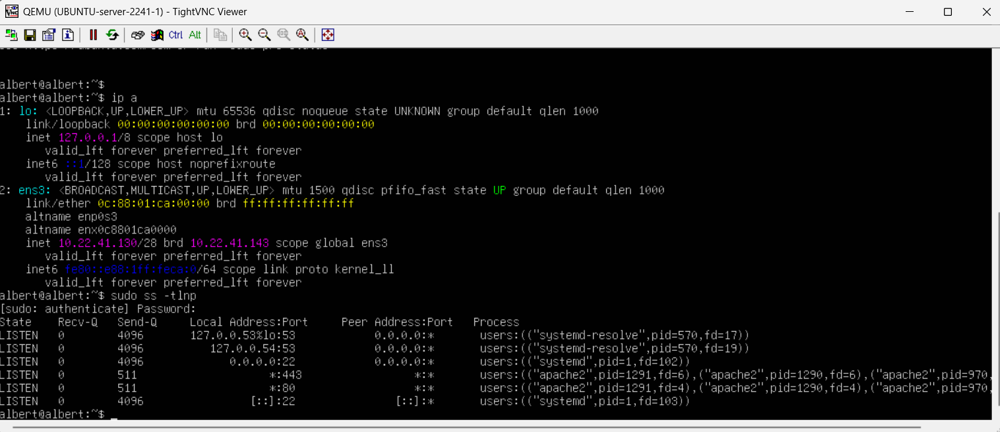

---

## 🔬 Funcionamiento de la Configuración

**Segmentación:** el switch entrega la VLAN 10 al usuario y la une por trunk al FortiGate, que termina la VLAN como subinterfaz 802.1Q sobre `port2` y le entrega direcciones por DHCP. El cliente VPN se conecta al FortiGate a través de un segundo switch hacia `port3`.

**Políticas de firewall** (evaluadas de arriba hacia abajo):

| # | Política | Origen | Destino | Servicio | Acción |
| --- | --- | --- | --- | --- | --- |
| 1 | `deny-direct-ssh-web` | Red de usuarios (`user-valn10`) | Servidor web (`web-sv-2241`) | SSH | DENY |
| 2 | `user-a-internet` | all | all | ALL | ACCEPT, con NAT |
| 3 | `vpn_vpn-remote-2241_remote_0` | Rango de la VPN (`vpn-remote-2241_range`) | Servidor web (`web-sv-2241`) | SSH | ACCEPT, con NAT |
| 4 | Implicit Deny | all | all | ALL | DENY |

- La política 1 va por encima de la 2 para que el SSH de la red de usuarios hacia el servidor se bloquee antes de que lo permita la política general.
- La política 2 deja pasar el resto del tráfico de los usuarios, incluido el HTTPS hacia el servidor.
- La política 3 es la que permite el SSH, y solo a quien llega por la VPN.
- Todo lo que no coincide con ninguna política cae en el *Implicit Deny*.

---

## 🔧 Configuración de la VPN

> La VPN se configuró desde la GUI de FortiOS (**VPN → IPsec Wizard**, plantilla *Dialup - FortiClient*). El cliente es un Ubuntu con strongSwan.

| Parámetro | Valor |
| --- | --- |
| Tipo | IPsec de acceso remoto (dial-up) |
| Interfaz del FortiGate | port3 (`192.168.237.2`) |
| Versión IKE | IKEv1, modo Aggressive |
| Autenticación | Clave precompartida + XAuth (usuario `vpn2241`) |
| Fase 1 | DES, SHA1, grupo Diffie-Hellman 5 (MODP 1536) |
| Fase 2 | ESP con DES y SHA1, PFS con grupo 5 |
| IP virtual del cliente | `10.212.135.10` |
| Tráfico protegido | `10.212.135.10/32` ↔ `10.22.41.130/32` (solo el servidor) |

Configuración de la VPN en el FortiGate:

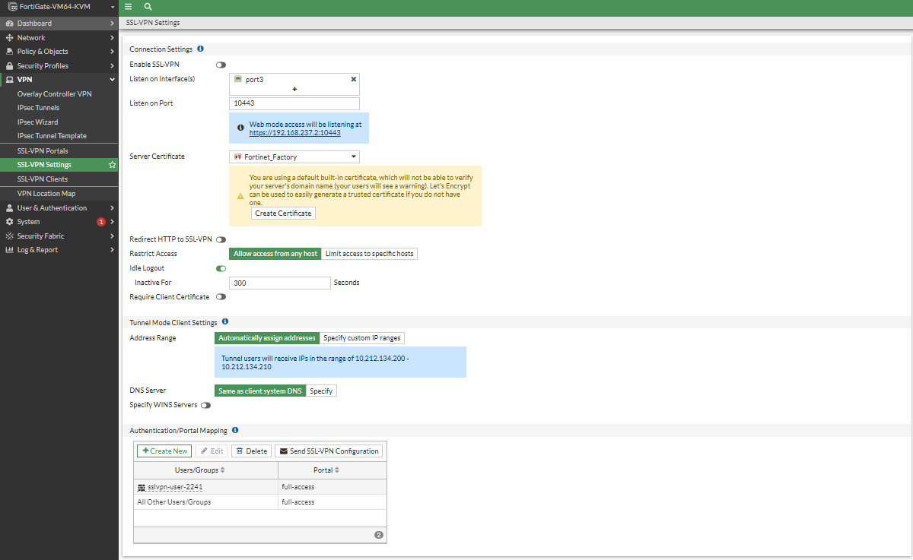

Grupo de usuarios de la VPN:

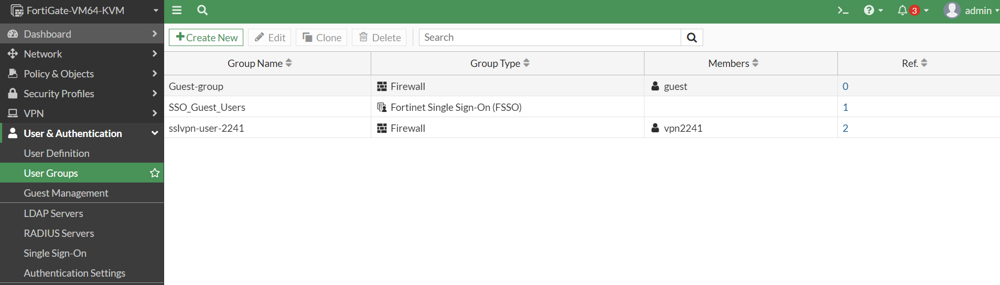

Usuario de la VPN:

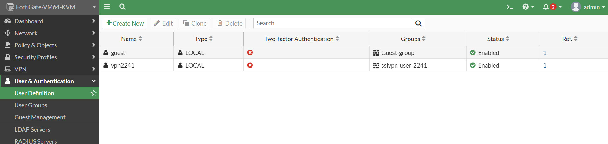

> La clave precompartida y la contraseña del usuario no se incluyen en este repositorio.

---

## ✅ Validación de la Implementación

**Prueba 1 — Usuario obtiene IP por DHCP y llega al servidor:** `ip a` en el usuario muestra una dirección de la red `10.22.41.0/25` asignada por el FortiGate, y el traceroute muestra el camino hacia el servidor (ver captura de la sección del usuario).

**Prueba 2 — HTTPS sin VPN:** con el túnel inactivo, el usuario normal accede al servidor web por HTTPS:

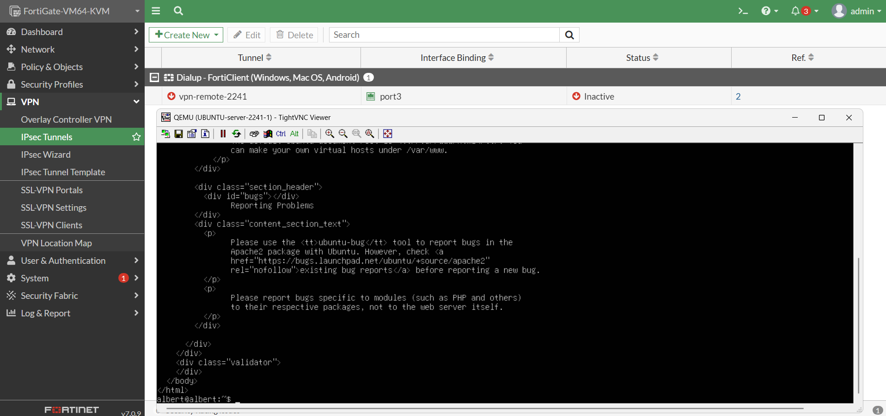

**Prueba 3 — SSH sin VPN:** con el túnel inactivo, el intento de SSH desde el usuario normal expira (`Connection timed out`) por la política `deny-direct-ssh-web`:

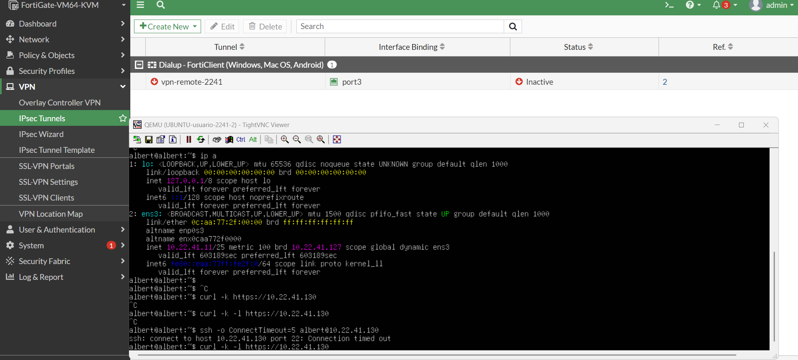

**Prueba 4 — Conexión de la VPN:** el cliente establece la conexión de acceso remoto (`connection 'VPN-REMOTE-2241' established successfully`) y recibe la IP virtual `10.212.135.10`:

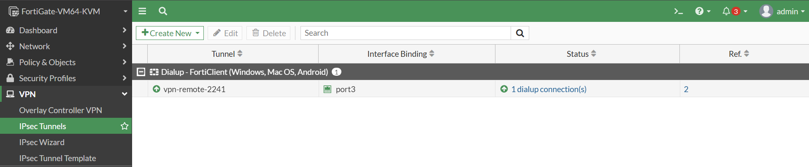

**Prueba 5 — SSH por la VPN:** con la VPN conectada, el cliente accede por SSH al servidor `10.22.41.130`:

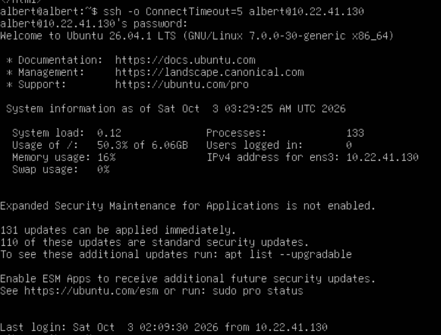

---

## 📁 Estructura del Repositorio

```
README.md
image/
├── 01-topologia.png
├── 02-interfaces-isp.png
├── 03-show-vlan-brief.png
├── 04-trunk-usuario.png
├── 05-switch-usuario-vpn.png
├── 06-usuario-dhcp-traceroute.png
├── 07-interfaces-fortigate.png
├── 08-vlan10-dhcp.png
├── 09-rutas-estaticas.png
├── 10-politicas-firewall.png
├── 11-configuracion-vpn.png
├── 12-grupo-vpn.png
├── 12-usuario-vpn.png
├── 13-interfaces-cisco.png
├── 14-restricciones-servidor.png
├── 15-servicios-servidor.png
├── 16-https-sin-vpn.png
├── 17-ssh-timeout-sin-vpn.png
├── 18-vpn-conectada.png
└── 19-ssh-via-vpn.png

running-configs/
├── isp.txt
├── router-cisco.txt
├── switch-2241-1.txt
├── switch-2241-2.txt
└── FortiGate.conf
```
